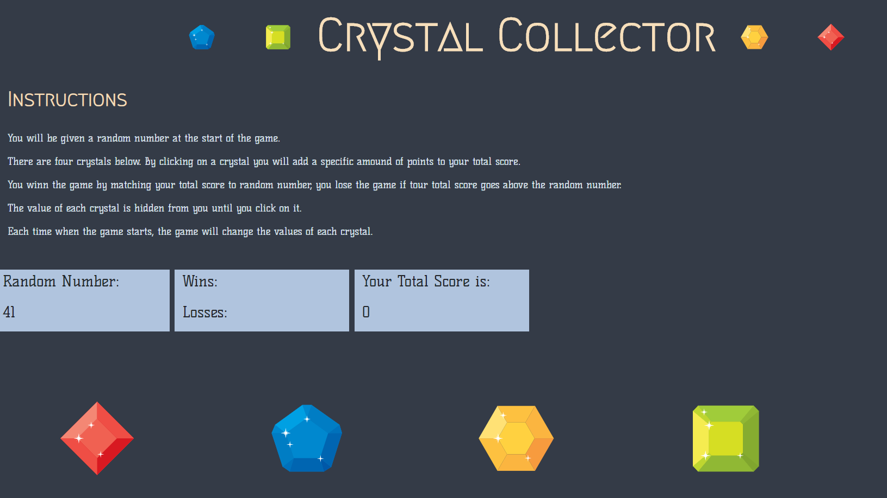
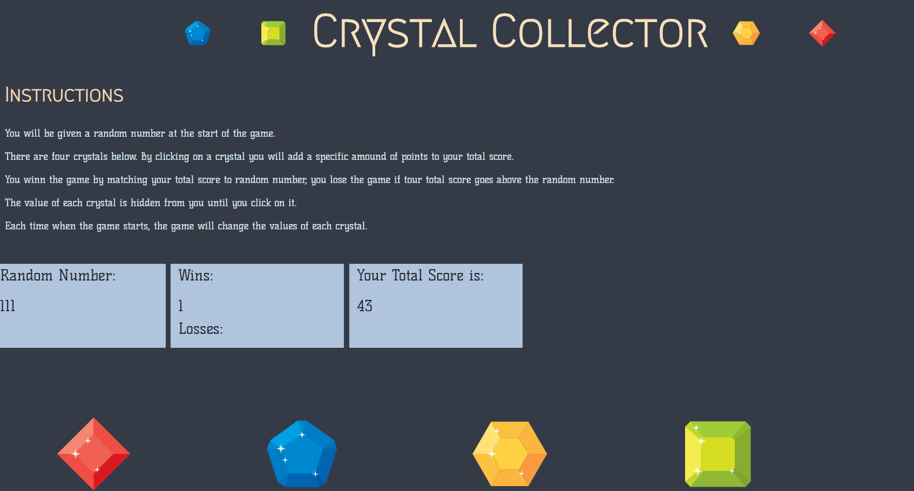

# unit-4-game
# Crystal Collector
---------------
## Table of Contents
1. [Abstract](#abstract)
2. [Coding Overview](#overview)
3. [Game Display](#display)

## Abstract
There are 4 different gems and each of them has a random value.
By clicking them a user collects a specific amount of points to reach the random number.
Once a player's collection of gem value equals to random number, user wins.
Otherwise user loses and scores are written on the board and game started again.

## Coding Overview

The game is built with;
* HTML
* CSS
* Bootstrap
* JavaScript
* jQuery

## Game Display

 

### P.S.

<a href="https://www.freepik.com/free-photos-vectors/background">Vectors created by macrovector - www.freepik.com</a>